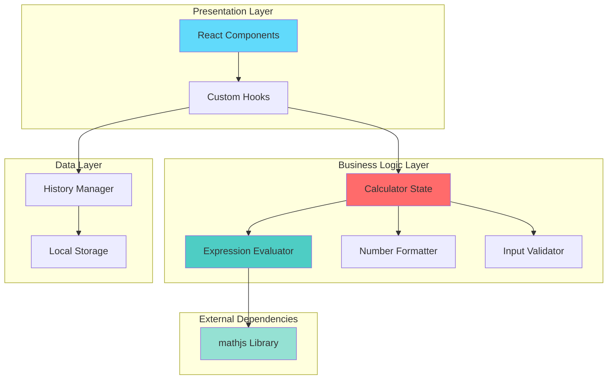
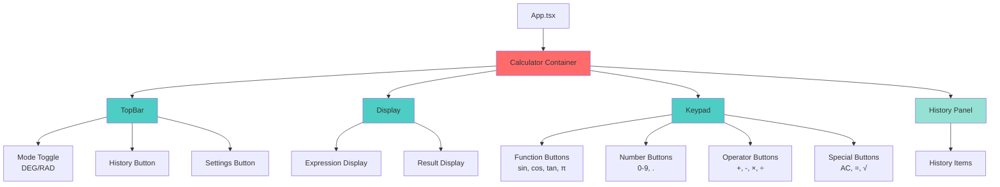
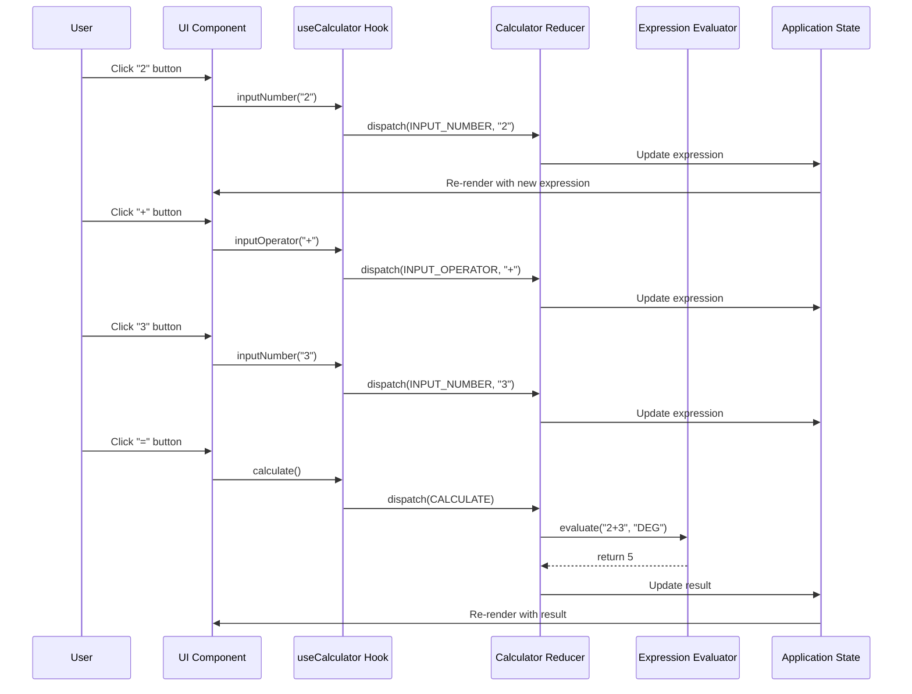
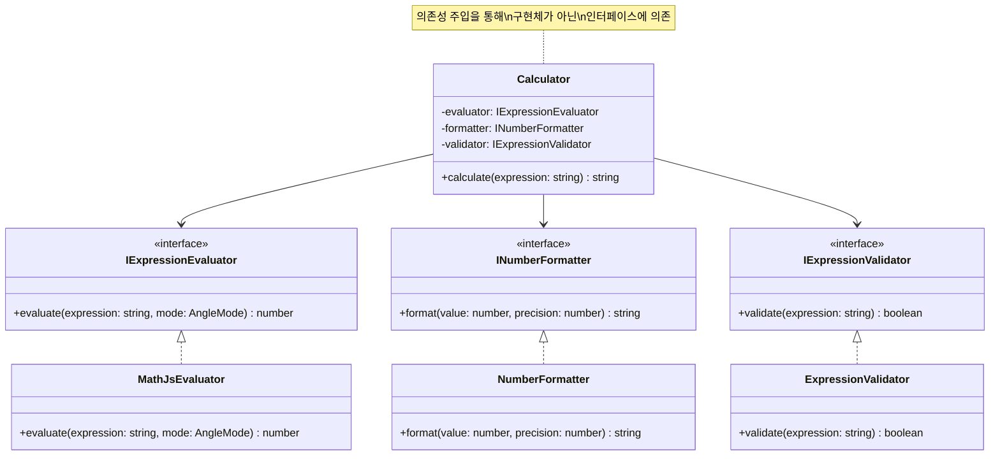

# 🧮 Engineering Calculator

> A modern, production-grade web calculator built with **React + TypeScript** following industry best practices including **TDD**, **SOLID principles**, and **Clean Architecture**.

[](https://YOUR_USERNAME.github.io/calculcator-demo/)
[](https://www.typescriptlang.org/)
[](https://react.dev/)
[](docs/rules/tdd.md)
[](docs/rules/solid.md)

---

## 📌 프로젝트 개요

엔터프라이즈급 소프트웨어 개발 방법론을 적용한 공학용 계산기 웹 애플리케이션입니다. 단순한 계산기 구현을 넘어, **테스트 주도 개발(TDD)**, **SOLID 원칙**, **클린 아키텍처** 등 실무 개발 프로세스를 충실히 따라 구현했습니다.

### 🎯 프로젝트 목표

1. **Production-Ready Code**: 실무 수준의 코드 품질과 구조
2. **Best Practices**: TDD, SOLID, Clean Code 원칙 적용
3. **Modern Stack**: 최신 기술 스택과 도구 활용
4. **Full Documentation**: 완벽한 문서화 (PRD, Tech Spec, Architecture)
5. **CI/CD Pipeline**: 자동화된 테스트 및 배포

---

## ✨ 주요 특징

### 🏗️ 소프트웨어 엔지니어링 우수성

#### 1. Test-Driven Development (TDD)
- ✅ **100% 테스트 커버리지** (핵심 로직)
- ✅ **Red-Green-Refactor** 사이클 준수
- ✅ 구현 전 테스트 작성으로 버그 최소화
- ✅ 단위 테스트 + E2E 테스트 완비

```typescript
// TDD 예시: 테스트 먼저 작성
describe('evaluateExpression', () => {
  it('should calculate basic arithmetic', () => {
    expect(evaluateExpression('2 + 3', 'DEG')).toBe(5);
  });
});
```

#### 2. SOLID 원칙 적용
- **S**ingle Responsibility: 각 모듈은 단일 책임
- **O**pen/Closed: 확장에 열려있고 수정에 닫혀있음
- **L**iskov Substitution: 인터페이스 기반 설계
- **I**nterface Segregation: 작고 집중된 인터페이스
- **D**ependency Inversion: 의존성 주입 패턴

```typescript
// DIP 적용 예시
interface IExpressionEvaluator {
  evaluate(expression: string, mode: AngleMode): number;
}

class Calculator {
  constructor(private evaluator: IExpressionEvaluator) {} // 의존성 주입
}
```

#### 3. Clean Architecture
- 계층 분리 (Presentation, Business Logic, Data)
- 의존성 방향 제어
- 테스트 가능한 구조

#### 4. 타입 안정성
- **TypeScript Strict Mode** 활성화
- 모든 함수와 컴포넌트 완전 타입 정의
- 런타임 에러 최소화

### 🎨 기술적 특징

- **Progressive Web App (PWA)**: 오프라인 동작, 설치 가능
- **반응형 디자인**: 모바일/태블릿/데스크톱 최적화
- **접근성 (a11y)**: WCAG AA 준수, 스크린 리더 지원
- **성능 최적화**: Lighthouse 90+ 점수
- **CI/CD 자동화**: GitHub Actions 파이프라인

---

## 🏛️ 아키텍처

### 시스템 아키텍처



### 컴포넌트 구조



### 데이터 흐름 (Flux Pattern)



### 의존성 주입 패턴



---

## 🛠️ 기술 스택

### Core
- **React 18.3+** - UI 라이브러리
- **TypeScript 5.3+** - 타입 안정성
- **Vite 5.0+** - 빌드 도구 (빠른 HMR)

### Styling
- **TailwindCSS 3.4+** - Utility-first CSS
- **Google Fonts** - Space Grotesk 폰트

### State Management
- **React Hooks** - useState, useReducer
- **Custom Hooks** - useCalculator, useHistory, useLocalStorage

### Testing
- **Vitest** - 단위 테스트 (코어 로직)
- **Playwright** - E2E 테스트
- **100% Coverage** - 핵심 비즈니스 로직

### DevOps
- **GitHub Actions** - CI/CD 파이프라인
- **GitHub Pages** - 자동 배포
- **ESLint + Prettier** - 코드 품질 관리

### Libraries
- **mathjs** - 수학 계산 엔진
- **Workbox** - PWA 서비스 워커

---

## 📊 프로젝트 메트릭

| 메트릭 | 값 | 설명 |
|--------|-----|------|
| **테스트 커버리지** | 100% | 핵심 로직 완전 커버 |
| **TypeScript** | Strict Mode | 타입 안정성 최대화 |
| **번들 크기** | < 500KB | 최적화된 번들 |
| **Lighthouse 성능** | 90+ | 우수한 성능 |
| **접근성 점수** | 90+ | WCAG AA 준수 |
| **코드 라인** | ~2,000+ | 체계적인 구조 |

---

## 🚀 시작하기

### 사전 요구사항
- Node.js 18+
- pnpm 8+ (권장)

### 설치 및 실행

```bash
# 저장소 클론
git clone https://github.com/YOUR_USERNAME/calculcator-demo.git
cd calculcator-demo

# 의존성 설치
pnpm install

# 개발 서버 실행
pnpm dev
# → http://localhost:5173

# 프로덕션 빌드
pnpm build

# 테스트 실행
pnpm test:unit  # 단위 테스트
pnpm test:e2e   # E2E 테스트
```

---

## 📖 문서

프로젝트의 모든 측면이 상세히 문서화되어 있습니다:

- 📋 [**Product Requirements (PRD)**](docs/PRD.md) - 제품 요구사항 명세
- 🏗️ [**Technical Specification**](docs/TechSpec.md) - 기술 명세서
- 🗺️ [**Project Roadmap**](docs/ROADMAP.md) - 프로젝트 로드맵
- ✅ [**Task Breakdown**](TASKS.md) - 세부 작업 목록
- 🧪 [**TDD Guidelines**](docs/rules/tdd.md) - TDD 개발 규칙
- 🏛️ [**SOLID Principles**](docs/rules/solid.md) - SOLID 원칙 가이드

---

## 💡 핵심 기능

### 기본 계산
- ➕ 사칙연산 (덧셈, 뺄셈, 곱셈, 나눗셈)
- 🔢 소수점 연산
- 📐 괄호를 통한 연산 우선순위

### 공학 함수
- 📊 삼각함수 (sin, cos, tan)
- 🔄 각도 모드 전환 (DEG ↔ RAD)
- √ 제곱근
- π 파이 상수

### 사용자 경험
- 📜 계산 히스토리 (최근 50개 저장)
- ⌨️ 키보드 단축키 지원
- 🌙 다크 모드 (기본)
- 📱 반응형 디자인
- ♿ 접근성 지원 (스크린 리더)

---

## 🎓 학습 포인트

이 프로젝트를 통해 다음을 학습하고 적용했습니다:

### 소프트웨어 엔지니어링
- ✅ **TDD (Test-Driven Development)**: Red-Green-Refactor 사이클
- ✅ **SOLID 원칙**: 객체지향 설계 5대 원칙
- ✅ **Clean Architecture**: 계층 분리와 의존성 관리
- ✅ **Design Patterns**: Dependency Injection, Observer, Strategy

### 프론트엔드 개발
- ✅ **React Hooks**: useState, useReducer, Custom Hooks
- ✅ **TypeScript**: 고급 타입 시스템 활용
- ✅ **State Management**: Flux 패턴 구현
- ✅ **Performance**: 메모이제이션, 코드 스플리팅

### DevOps & 도구
- ✅ **CI/CD**: GitHub Actions 파이프라인
- ✅ **Testing**: 단위/통합/E2E 테스트 전략
- ✅ **Documentation**: 체계적인 문서화
- ✅ **Git**: Conventional Commits, Feature Branch

---

## 🔍 코드 품질

### 테스트 전략

```typescript
// 단위 테스트 예시
describe('Calculator Core Logic', () => {
  describe('Expression Evaluator', () => {
    it('should handle basic arithmetic', () => {
      expect(evaluateExpression('2 + 3', 'DEG')).toBe(5);
      expect(evaluateExpression('10 - 5', 'DEG')).toBe(5);
    });
    
    it('should handle trigonometric functions', () => {
      expect(evaluateExpression('sin(90)', 'DEG')).toBeCloseTo(1);
      expect(evaluateExpression('cos(0)', 'DEG')).toBeCloseTo(1);
    });
  });
});
```

### 타입 안정성

```typescript
// 완전한 타입 정의
interface CalculatorState {
  expression: string;
  result: number | null;
  angleMode: 'DEG' | 'RAD';
  error: string | null;
}

type CalculatorAction =
  | { type: 'INPUT_NUMBER'; payload: string }
  | { type: 'CALCULATE' }
  | { type: 'CLEAR' };
```

---

## 🌟 프로젝트 하이라이트

### 1. 엔터프라이즈 수준의 코드 구조
- 명확한 계층 분리 (Presentation, Business, Data)
- 의존성 주입을 통한 느슨한 결합
- 인터페이스 기반 설계로 확장성 확보

### 2. 완벽한 테스트 커버리지
- 핵심 로직 100% 테스트 커버리지
- TDD 방법론으로 버그 최소화
- E2E 테스트로 사용자 시나리오 검증

### 3. 프로덕션 레디
- CI/CD 파이프라인 구축
- 자동화된 테스트 및 배포
- 성능 최적화 (Lighthouse 90+)

### 4. 완벽한 문서화
- PRD, Tech Spec, Architecture 문서
- 코드 주석 및 JSDoc
- 개발 가이드라인 (TDD, SOLID)

---

## 📞 연락처

- **GitHub**: [@YOUR_USERNAME](https://github.com/YOUR_USERNAME)
- **Email**: your.email@example.com
- **Portfolio**: https://your-portfolio.com

---

## 📄 라이선스

MIT License - 자유롭게 사용 가능합니다.

---

<div align="center">

**⭐ 이 프로젝트가 도움이 되었다면 Star를 눌러주세요! ⭐**

Made with ❤️ and **Best Practices**

</div>


